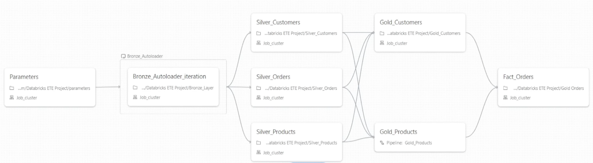

# Azure Databricks Data Lakehouse Pipeline

End-to-end lakehouse pipeline on Azure Databricks that ingests raw data via Auto Loader,
transforms through Medallion Architecture (Bronze → Silver → Gold), and builds a Star Schema
dimensional model with SCD Type 1 & 2 — governed by Unity Catalog.

## Architecture

```
ADLS Gen2 (Source)                    Unity Catalog
 ┌──────────┐                     ┌──────────────────┐
 │ Parquet   │                     │ databricks_catalog│
 │ files     │                     │ ├── bronze       │
 └─────┬─────┘                     │ ├── silver       │
       │                           │ └── gold         │
       ▼                           └──────────────────┘
┌──────────────────┐    ┌──────────────┐    ┌──────────────────────────────┐
│      Bronze      │───▶│    Silver    │───▶│            Gold              │
│   Auto Loader    │    │  Cleanse &   │    │                              │
│   (Streaming)    │    │  Transform   │    │  DimCustomers (SCD1, MERGE)  │
│                  │    │              │    │  DimProducts  (SCD2, DLT)    │
│ checkpoint       │    │  customers   │    │  FactOrders   (MERGE)        │
│ schema evolution │    │  orders      │    │                              │
│                  │    │  products    │    │  Optimizations:              │
│                  │    │  regions     │    │  broadcast / partition /     │
│                  │    │              │    │  Z-ORDER / column pruning    │
└──────────────────┘    └──────────────┘    └──────────────────────────────┘
   ADLS bronze        ADLS silver              ADLS gold
   (Parquet)          (Delta Lake)             (Delta Lake)
```

**Orchestration:**



```
parameters.ipynb → [output_datasets via task values]
       │
       ├── Bronze_Layer.ipynb (file_name=orders)
       ├── Bronze_Layer.ipynb (file_name=customers)     ← parameterized, one notebook
       └── Bronze_Layer.ipynb (file_name=products)         handles all datasets
               │
               ├── Silver_Customers.ipynb ┐
               ├── Silver_Orders.ipynb    ├── parallel
               ├── Silver_Products.ipynb  │
               └── Silver_Regions.ipynb   ┘
                       │
                       ├── Gold_Customers.ipynb (SCD1)  ┐
                       └── Gold Products.ipynb  (DLT SCD2) ┘ parallel
                                      │
                               Gold Orders.ipynb (Fact)  ← waits for both dims
```

---

## Key Design Decisions

| Decision | Approach | Why |
|----------|----------|-----|
| **Bronze ingestion** | Auto Loader (`cloudFiles`) + `trigger(once=True)` | Supports schema evolution and checkpoint-based incremental file discovery; `trigger(once=True)` enables scheduled batch processing |
| **Parameterized Bronze** | Single notebook + Databricks widgets + `taskValues` | One notebook handles N datasets — avoids code duplication |
| **DimCustomers — SCD Type 1** | Manual Delta MERGE with surrogate key generation | Customer attributes (email, address) only need current state; explicit MERGE gives full control over new/existing record split |
| **DimProducts — SCD Type 2** | DLT `apply_changes(stored_as_scd_type=2)` | Product price changes need full version history; DLT automates `__START_AT`/`__END_AT` lifecycle management |
| **FactOrders optimization** | Column pruning → broadcast join → partitionBy(year) → Z-ORDER | Read less → shuffle less → prune partitions on time queries → skip files on customer lookups |
| **Data governance** | Unity Catalog for all tables + UDFs | Centralized metadata, lineage, and access control across Bronze/Silver/Gold |

---

## Spark Optimizations (Gold Orders)

| Technique | Implementation | Benefit |
|-----------|---------------|---------|
| **Column Pruning** | Explicit `SELECT` of 6 columns instead of `SELECT *` | Reduces I/O and shuffle volume |
| **Broadcast Join** | `broadcast()` on DimCustomers and DimProducts | Eliminates shuffle of the large fact table |
| **Partition Pruning** | `partitionBy("year")` on FactOrders | Year-based queries skip entire partitions |
| **Z-ORDER** | `OPTIMIZE ... ZORDER BY (DimCustomerKey)` | Co-locates data for customer-level point lookups |

---

## Project Structure

```
├── parameters.ipynb          # Outputs dataset list via dbutils.jobs.taskValues
├── Bronze_Layer.ipynb        # Parameterized Auto Loader ingestion (source → bronze)
├── Silver_Customers.ipynb    # Email domain extraction, full_name composition
├── Silver_Orders.ipynb       # Timestamp casting, year derivation, window functions
├── Silver_Products.ipynb     # SQL UDF (discount) + Python UDF (uppercase) in UC
├── Silver_Regions.ipynb      # Pass-through cleansing from UC bronze table
├── Gold_Customers.ipynb      # SCD Type 1: dedup, new/old split, surrogate key, MERGE
├── Gold Products.ipynb       # SCD Type 2: DLT expectations + apply_changes
├── Gold Orders.ipynb         # Fact table: broadcast join, partition, Z-ORDER, MERGE
├── datasets/                 # Source Parquet files (first + second batch)
│   ├── customer_first.parquet
│   ├── customers_second.parquet
│   ├── orders_first.parquet
│   ├── orders_second.parquet
│   ├── products_first.parquet
│   ├── products_second.parquet
│   └── regions.parquet
└── README.md
```

---

## Tech Stack

- **Azure Databricks** (DBR 13.x+) — Unified analytics platform
- **ADLS Gen2** (ABFSS) — Cloud storage for all medallion layers
- **Delta Lake** — ACID transactions, time travel, MERGE upserts
- **Unity Catalog** — Centralized governance for tables, UDFs, and lineage
- **Delta Live Tables (DLT)** — Declarative ETL with data quality expectations and SCD2
- **Spark Structured Streaming** — Auto Loader with checkpoint-based incremental ingestion
- **PySpark** — DataFrame transformations, window functions, UDFs
- **Databricks Jobs** — Multi-task orchestration with parameterized notebooks and task values
